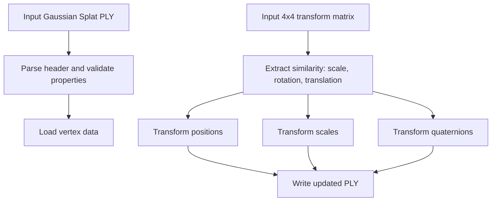

# Gaussian Splat PLY Similarity Transform Applier ```TansformationKeepSplat.py```


Before running this script make sure to run ``` save_transformation.py``` to have the transformation .npy file avaialable in your local dir. Edit ``` save_transformation.py``` with your own transformation matrix.

This script applies a **4×4 similarity transform** (uniform scale + rotation + translation) to a **Gaussian Splatting PLY** (binary little-endian, float32) in the common “SuperSplat-style” vertex layout.

It updates:

* **Position**: `x, y, z`
* **Per-Gaussian scale**: `scale_0, scale_1, scale_2` (supports `linear` or `log` storage)
* **Per-Gaussian rotation**: quaternion `rot_0..rot_3` (supports `wxyz` or `xyzw` ordering)

It **does not modify** color / SH coefficients (`f_dc_*`, `f_rest_*`) or `opacity`.

---

## What problem does this solve?

When you align or register a splat scene to another coordinate system (for example ICP alignment to LiDAR, or aligning splats to a reconstructed mesh), you typically obtain a **4×4 transform matrix**.

This script applies that transform **directly to the splat PLY**, allowing the splats to be visualized correctly in the new coordinate frame (SuperSplat, Unreal Engine, etc.).

---

## Requirements

* Python 3
* NumPy

Install:

```bash
pip install numpy
```

---

## Usage

### Basic

```bash
python apply_splat_transform.py input.ply output.ply --matrix transform.npy
```
### Advance 
Use the advance command (on our recent file experiment) 
```bash
python transform_splat_ply.py input_splat.ply output_splat_global.ply --matrix T_global.npy --scale_mode log --quat_order wxyz --compose left

```
### Supported matrix formats

* `.npy` containing a **4×4** matrix
* `.txt` containing **16 numbers** (row-major), reshaped to **4×4**

Example `.txt`:

```txt
1 0 0 1
0 1 0 2
0 0 1 3
0 0 0 1
```

Run:

```bash
python apply_splat_transform.py input.ply output.ply --matrix transform.txt
```

---

## Options

| Flag           | Values          | Default      | Meaning                           |
| -------------- | --------------- | ------------ | --------------------------------- |
| `--matrix`     | path            | **required** | 4×4 transform in `.npy` or `.txt` |
| `--scale_mode` | `log`, `linear` | `log`        | How `scale_0..2` are stored       |
| `--quat_order` | `wxyz`, `xyzw`  | `wxyz`       | Quaternion ordering in file       |
| `--compose`    | `left`, `right` | `left`       | Quaternion composition direction  |

Examples:

```bash
# Scales stored as linear
python apply_splat_transform.py in.ply out.ply --matrix T.npy --scale_mode linear

# File stores quaternions as (x, y, z, w)
python apply_splat_transform.py in.ply out.ply --matrix T.npy --quat_order xyzw

# Compose rotation on the right: q' = q ⊗ qR
python apply_splat_transform.py in.ply out.ply --matrix T.npy --compose right
```

---

## Expected PLY format

The script expects:

* `binary_little_endian` PLY
* Vertex table of **float32 values**
* Property ordering matching common **3D Gaussian Splat** exports

If the header differs, the script will raise:

```
PLY properties do not match expected Gaussian Splat layout
```

In that case, adapt the expected property list in the script.

---

## Workflow overview



---

## Mathematical overview

### Similarity transform extraction

Given:

```
T = [ Rs  t ]
    [ 0   1 ]
```

* **Scale**

  ```
  s = mean(norm(Rs column vectors))
  ```

* **Rotation**

  ```
  R = Rs / s
  ```

* **Translation**

  ```
  t = last column of T
  ```

---

### Position update

For each Gaussian center **x**:

```
x' = s · (R x) + t
```

---

### Scale update

If stored as **linear**:

```
a' = s · a
```

If stored as **log-scale**:

```
log(a') = log(a) + log(s)
```

---

### Quaternion rotation update

Steps:

1. Normalize quaternion **q**
2. Convert rotation matrix **R** → quaternion **qR**
3. Compose:

```
left:  q' = qR ⊗ q
right: q' = q ⊗ qR
```

4. Normalize again

---

## Output

The output PLY:

* Preserves the **original header**
* Writes updated **float32 vertex data**
* Prints:

```
Wrote: output.ply
Applied similarity scale = ...
Translation = [...]
Rotation matrix = ...
```

---

## Common pitfalls

### Property mismatch error

Your PLY layout differs from the expected Gaussian splat format.
Adjust the property list in the script.

---

### Splats appear too small or too large

Likely a **unit mismatch** in the transform scale (meters vs centimeters, etc.).
Check the printed scale value.

---

### Rotation looks incorrect

Try switching:

* `--quat_order wxyz` ↔ `xyzw`
* `--compose left` ↔ `right`

---

## Notes

* Only **uniform similarity transforms** are supported
* Only **float32 binary little-endian PLY** is supported
* Color / SH coefficients remain unchanged

---

